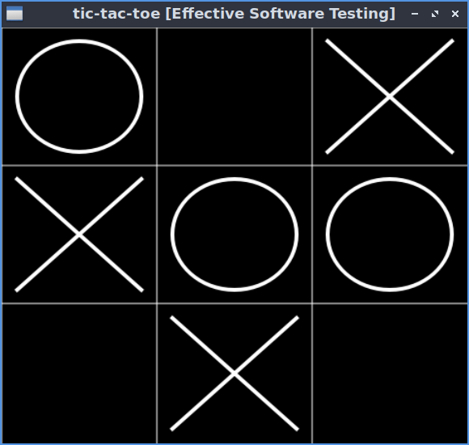

## Description

A good test suite makes extending, maintaining and debugging a codebase both easier and
faster. In this course we will look at the different kinds of tests, and understand how to write
good tests. We will also cover different testing strategies, such as test-driven-design when
writing new code, or acceptance testing when working with legacy code that doesn’t have a
good test suite. Code samples will use the Python testing framework pytest but the concepts
also apply to other frameworks and languages

## Slides

<iframe src="https://docs.google.com/presentation/d/e/2PACX-1vSqBlhIGMFkkWAiwTqUHYu6BugF846n45BPU288re_3hec6HTBLtrqWd1Xuco9aBIzCChCr4bYYYTZj/embed?start=false&loop=false&delayms=3000" frameborder="0" width="960" height="569" allowfullscreen="true" mozallowfullscreen="true" webkitallowfullscreen="true"></iframe>

[download slides as pdf](https://github.com/ssciwr/effective-software-testing/raw/main/docs/slides/slides.pdf) | [download course description as pdf](https://ssc.iwr.uni-heidelberg.de/sites/default/files/effective-software-testing.pdf)

## Sample code

A sample project including a test suite is provided at [github.com/ssciwr/effective-software-testing](https://github.com/ssciwr/effective-software-testing)

The sample project is a simple implementation of the game "tic-tac-toe".



To clone the repo and do an editable install of the package:

```
git clone https://github.com/ssciwr/effective-software-testing.git
cd effective-software-testing
python -m pip install --editable .[tests]
```

To run the tests:

```
python -m pytest
```

To play the tic-tac-toe game on a 4x4 board:

```
tic-tac-toe --size 4
```
