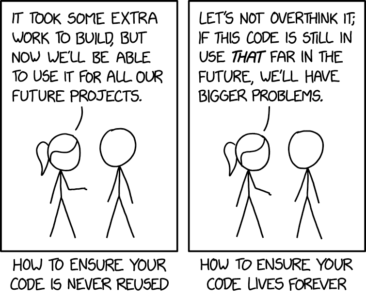
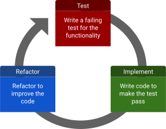

<!-- _class: title -->
<!-- _paginate: false -->
<!-- _footer: "2024.07.16" -->

# Effective Software Testing

## Liam Keegan, SSC

---

# Course Outline

- Testing
  - Benefits of a good test suite, difficulties of creating one
- Types of tests
  - Different types of tests, their use cases
- Best practices
  - How to write good tests
- Testing strategies
  - Strategies for testing new and legacy code
- Hands on with pytest
  - Test driven development with pytest

---

<!-- _class: subtitle -->

# Testing

---

# What is testing anyway?

There are many ways in which all software is tested:

- It is "tested" every time it is used and produces some output
- It was probably tested with some sample inputs when written
- There is probably some manual testing when changes are made

However this kind of "testing" can quickly become both insufficient and inefficient as a software project grows in complexity.

Changing the code risks breaking things that previously worked without notice, and manually testing all the functionality quickly becomes an impossible task

---

# Automated tests

Many software projects also have automated tests

- A test is a piece of code that tests some behaviour of the software
- A test suite is a collection of such tests
- The test suite typically runs automatically whenever a change is made
- The more complex the project, the more value a good test suite provides
- But a test suite is not only for large projects!

This is the kind of testing we will learn about in this course.

---

# A good test suite provides many benefits

- Ensure **correctness** of your code when you write it
- **Maintain** correctness of your code as things change around it
- Make changes or **refactor** code without fear
- Find bugs **earlier** and more easily
- Easier for new contributors to make **positive** changes
- Complements the **documentation** as examples of use
- Gives others **confidence** in the correctness of your code
- Encourages **well-designed** modular code and interfaces

---

# So why doesn't every project have one?

- Requires upfront investment to create
- Changing code (often) also requires changing tests
  - Mitigated by writing good tests that are not brittle
- Slows (initial) speed of development
  - But speeds up later development and improves quality
- Hard to retrofit to legacy code
  - Approval testing strategy can help
- Bad tests can be worse than no tests
  - False negative tests can waste time or result in test failures being ignored
  - False positive tests can give false sense of security

---

# Motivating example

- Imagine you have an existing, working software project
  - You want to add a small feature
  - You inadvertently break some other functionality with your changes
- With only manual tests
  - You don't find this bug with your manual testing of the new functionality: Bad!
- With a brittle test suite
  - The tests for the broken functionality fail: Good!
  - So do a bunch of unrelated tests for unrelated reasons: Bad!
  - Either you waste a lot of time fixing all these unrelated test failures & find the bug
  - Or you ignore them and miss the actual bug in all the noise
- With an effective test suite
  - The tests for the broken functionality fail & you find the bug: Good!

---

<!-- _class: subtitle -->

# Types of Tests

---

# Types of tests

- Unit tests
- Integration tests
- System tests
- Regression tests
- Approval tests
- Acceptance tests
- Smoke tests
- Performance tests
- Fuzzing tests
- Property based tests
- …

---

# Unit tests

- Small, self-contained test of a piece of functionality
- Narrow scope: typically a class or method
- Fast to run
- Doesn't depend on any other components
  - Dependencies sometimes replaced with mocks or doubles
- Typically most (e.g. 80%) of your tests should be unit tests
- Primary way of testing correctness
- Should be written alongside the functionality being tested
- Failing unit test directly tells you what has gone wrong

---

# Integration / System tests

- Also known as "end-to-end" or "functional" tests
- Tests involving multiple interacting components
- Should be a smaller fraction (e.g. 20%) of your test suite
- Compared to unit tests
  - Typically take longer to run
  - Typically more risks of being brittle or flaky
  - Typically need more maintenance
- If most tests end up as integration tests, consider making code more modular
- Larger projects may have a hierarchy of these
  - Different categories of size / complexity of tests, e.g.
  - Integration tests < Functional tests < GUI tests < End-to-end tests

---

# Regression tests

- Tests written when a bug is found
- Can be unit or integration tests
- They initially demonstrate the existence of the bug
- Once the bug is fixed, they ensure it doesn't come back
- Ideally: make a PR with two commits
  - First commit adds the regression test, CI now fails
  - Second commit fixes the bug, CI passes
- Note:
  - The phrase "regression testing" is also used to describe the process of running the test suite after changing the code to check for any regressions (failing tests)

---

# Approval tests

- Useful when dealing with legacy code that lacks tests
- Run a function, record the output, test that it gives this output
- This is not how you would write a test for new code!
- These are not testing for correctness, only for consistency
- But quick to create and can be done without deep understanding of the code
- Then you can start to refactor or make changes
- At least you get a test failure when the outputs change
- Note:
  - "approval testing" is also used to describe the tests a customer might make of a piece of software they commissioned to approve that it fulfils their requirements

---

# Performance tests

- Test performance using benchmarks for specific workloads
- e.g. CPU time taken to perform a benchmark task
  - Typically need dedicated hardware for this to be reliable
- e.g. perform a task with
  - High CPU load
  - Large amounts of data
  - Many concurrent requests
  - Etc
- Fail criteria can include
  - Incorrect output
  - Benchmark being significantly slower than previously

---

# Smoke tests

- Basic sanity check: does it run without crashing?
- Electronics analogy
  - is there smoke when you switch it on?
- Plumbing analogy
  - fill pipes with smoke, does it escape?
- Can be a useful pre-test test suite
  - If this fails don't need to run the expensive full test suite

---

# Fuzzing tests

- Fuzzers are testing tools that generate many random inputs
- They call your code with these inputs and try to cause problems
- Typically used for low-level C++ libraries
- Nowadays also used for Python libraries
- C++: [llvm.org/docs/LibFuzzer.html](https://llvm.org/docs/LibFuzzer.html)
- Python: [pypi.org/project/atheris](https://pypi.org/project/atheris)

---

# Property based tests

- You define properties of your code, for example
  - Given any string, this function always returns a number
  - This function never throws an uncaught exception
  - For inputs between 0 and 4, this function returns values between -1 and 1
- Tests automatically generate many inputs and check these properties hold
- When an input is found where a property is violated
  - The input is simplified as much as possible (shrinking) while still causing the test to fail
- Useful for
  - Automatically generating test inputs for regression tests
  - Finding and testing edge cases
  - Testing algorithms with well defined properties
- In general (imo) not a replacement for example-based tests
- Python: [pypi.org/project/hypothesis](https://pypi.org/project/hypothesis)

---

# Good tests are…

- Correct
  - They test that the thing they are testing is working
- Readable
  - It is obvious from looking at it what the test does
- Complete
  - They covers all relevant cases and behaviours
- Documentation
  - They demonstrate how the code being tested should be used
- Resilient
  - They only fail when the thing being tested is false, not for any other reason
- Unchanging
  - They don't need to be modified unless the behaviour being tested changes

---

# Can a test be unchanging?

- Types of changes to the software:
  - Refactoring: internal implementation changes
  - New feature: add some new behaviour
  - Bug fix: fix a bug that was found
  - Change behaviour: change the existing behaviour
- Ideal case: only changes in behaviour should require tests to be updated
  - Refactoring: no change to existing tests, no new tests
  - New feature: no change to existing tests, add new tests for new behaviour
  - Bug fix: no change to existing tests, add new tests for bug
  - Change behaviour: update existing tests

---

<!-- _class: subtitle -->

# Best Practices

---

# Build a testing pyramid


---

# Don't test unrelated things

- Don't assert things unrelated to the thing you are testing
- Avoid assumptions about the internal structure of the code

Why?

- Avoid the test becoming brittle / noisy
  - Unrelated changes should not cause the test to fail
- Make the test more maintainable
  - Unrelated changes should not require the test to be updated
- Make the meaning of the test clear
  - Test failure should tell you what broke and what needs to be fixed

---

# Test using public APIs

- Tests should use the same interfaces as user code
- Tests should not use or rely on private implementation details
- Also known as "black box" vs "white box" testing

Why?

- Avoids needing to update tests when internal implementation changes
- More realistic / representative use of code
- Tests can serve as examples of use / documentation
- Encourages good API design

---

# Test state, not interactions

- A test can check state: state of the system after some actions (i.e. what)
- Or it can check interactions: which actions did the system do (i.e. how)
- It is better to test state than interactions

Why?

- Less brittle to check **what** happened than **how** it happened
- Less likely to depend on internal implementation details
- Avoids needing to update tests when internal implementation changes

---

# Test behaviours, not methods

- Having a test for a method often involves testing multiple behaviours
- Better to have a separate test for each behaviour
- E.g. *given* state X, *when* action Y, *then* state Z

Why?

- Keep meaning of a test clear
- Avoid complexity of test for a method growing over time
- See also BDD: "behaviour driven development"

---

# Keep test code simple

- Test code should be "obvious upon inspection"
- Should be complete: contain enough information to understand the test
- Should be concise: don't include irrelevant information
- Avoid "clever" code, complex control flow, magic numbers, etc
- Some code repetition between tests is ok if it makes test code simpler

Why?

- There are no tests for your tests!
- When a test fails, reading the test code should tell you what is wrong

---

# Aim for completeness

- Generally impossible to test all possible combinations of inputs
- But many inputs are equivalent in terms of the resulting code path
- Attempt to identify "equivalence classes" and test one from each
- Often the edges of a range are worth testing
- For sequences, a good starting point: 0 elements, 1 element, many elements
- Also "interesting" (in your opinion) values or edge cases

Why?

- We can only prove that code is incorrect with a failed test
- No number of passed tests can prove correctness
- So we need to do our best to create tests that can fail

---

# Aim for validity

- Ensure that every test can fail!
- Avoid circular logic
  - e.g. same code in test as in implementation
  - This test is assuming the implementation is correct and will always pass
- Use appropriate numerical conditions
  - E.g. 3 <= pi() <= 4 will pass for many outputs that may be unacceptable
  - But pi() == 3.1415926535897 may fail for an output that was actually ok
  - Often a sensible choice here depends on your use case
- Often worth testing the test
  - Intentionally (temporarily) break the implementation in some way
  - Check the test actually fails!

---

# Name tests well

- Test names should include the behaviour being tested
- Seeing the failing test name should already give a good idea what is broken
- It is fine if this makes the test name long
  - We're not **calling** this function in our code, it being long doesn't matter
  - We're **reading** its name in a failing test report, a human should understand its intent
- Some examples: bad short name -> better longer name
  - `test0` -> `test_divide_by_zero_raises_exception`
  - `test_auth` -> `test_invalid_user_should_deny_access`
  - `test_widget` -> `test_mouse_click_on_widget_changes_colour`
- Consider a sentence involving "should" as a starting point for the name
- Try to ensure consistency in test naming

---

<!-- _class: subtitle -->

# Testing Strategies

---

# Sensible defaults

Testing has costs as well as benefits, which both depend on the type of testing and the type of project.

We'll describe a few common scenarios, with suggestions for how to effectively use tests in each scenario to make your life easier.

---

# Something to avoid

The project begins

- The project is small, relatively simple
- Manual tests are sufficient, no need to write automated tests

The project grows

- Gradually more features are added, things get complicated
- Manual testing is no longer enough, things break every time anything is changed

I guess we need some tests

- But retrofitting unit tests everywhere would now be a huge job…
- Maybe we should just add some integration/approval tests?…
- Notice how your new project is already looking like legacy code!

---

# Scale and future-proofing



[xkcd.com/2730](https://xkcd.com/2730)

---

# Scenario: New code

- Write unit tests as you write code (test driven development)
  - TDD: first write a failing test, then write code so that it passes, then refactor
  - Alternative: first write a small piece of code, then a test for that code
  - Less good: write a bunch of code, then later add a bunch of tests
- Benefits
  - Makes you think about the API before / as well as the implementation
  - Forces you to actually use the API of the code you just wrote
    - If writing unit tests using this API is difficult, maybe the design could be better?
  - Tests are not added as an afterthought
  - Writing a failing test before the code to make it pass ensures the test can actually fail

---

# Scenario: Legacy code

- You have inherited a large codebase without tests
- How do you safely extend or modify it without inadvertently breaking things?
  - Adding unit tests for everything is typically unrealistic
  - You might not even know what much of the code does
- One strategy here is to generate approval tests
  - Run the code with some valid input, save the output
  - Write a test that does this and checks that the output is still the same
  - Like this you can quickly construct a test suite
  - These are not very good tests, but they are much better than nothing!
  - You then at least have a warning when a change you make modifies the existing behaviour
- Your new code should have unit tests as normal

---

# Scenario: Jupyter notebooks

- What about if you write code in jupyter notebooks?
- You can use the [ipytest](https://github.com/chmp/ipytest) package to run tests inside the notebook
  - `pip install ipytest`
- Write your pytest test case inside a notebook cell
- Add this command to the first line of the cell:
  - `%%ipytest`
- Executing the cell will run pytest & display the output below the cell

A big advantage of this over just manually running code in a cell to test things is that if you later transfer this code into a python module or package you can also transfer the tests.

---

<!-- _class: subtitle -->

# pytest

---

# Pytest

- pytest is a widely used Python test framework
- Makes it easy to write small and readable tests
- Also offers more advanced features such as fixtures and mocks
- Large ecosystem of plugins providing additional functionality
- Well documented: [docs.pytest.org](https://docs.pytest.org)
- Simple installation
  - `pip install pytest`
  - `conda install pytest`
- Quick overview:
  - [ssciwr.github.io/lunch-time-python/lunchtime4/lunchtime4.slides.html](https://ssciwr.github.io/lunch-time-python/lunchtime4/lunchtime4.slides.html)

---

# Pytest in one slide

- Install it
  - `python -m pip install pytest`
- For every file `x.py`, add a file `test_x.py` in a folder called `tests`
  - `test_player.py`
- In this file, write functions that start with `test_`
  - `def test_player_initial_age_zero():`
- Assert things inside these functions about your code
  - `player = Player()`
  - `assert player.age == 0`
- Run pytest
  - `python -m pytest`
- You now have an automated test suite!

---

# Pytest exceptions

- How do we assert that code should raise an exception?
- Use the `pytest.raises` context manager

```python
import pytest

def test_exception():
    my_list = [1, 2, 3]
    with pytest.raises(IndexError):
        my_list[5]
```

---

# Pytest temporary files

- How do we create a temporary folder for a test?
- Use the `tmp_path` fixture

```python
def test_write(tmp_path):
    print(tmp_path)
    assert str(tmp_path) != ""
```

---

# Pytest parameterize tests

- How do we repeat a test with different inputs?
- Use the `@pytest.mark.parametrize` decorator

```python
@pytest.mark.parametrize("row,col", [(-1, -2), (51, 24), (8, 7)])
@pytest.mark.parametrize("n", [1, 2, 3])
def test_empty_board_make_move_invalid_square(
    n: int, row: int, col: int
) -> None:
    board = Board(n)
    assert board.valid(row, col) is False
```

---

# Pytest mocking

- How do we mock an attribute or environment variable?
- Use the `monkeypatch` fixture

```python
def test_message_box(monkeypatch: MonkeyPatch):

    def do_nothing(*args, **kwargs):
        return

    monkeypatch.setattr(QMessageBox, "information", do_nothing)
    QMessageBox.information(None, "title", "text")
```

---

# Pytest fixtures

- How do we inherit or reuse context, data and mocks?
- Create and use `fixtures`
- Fixtures can themselves use other fixtures

```python
@pytest.fixture()
def colors() -> List:
    return ["red", "green", "blue"]

def test_colors(colors):
    assert colors[0] == "red"
    assert len(colors) == 3
```

---

<!-- _class: subtitle -->

# Hands on TDD with pytest

---

# Hands on with pytest

- Start working on a simple tic-tac-toe game in Python
- We'll develop some (very) basic functionality together
- Do this in a TDD (test-driven-development) style



- Test: Write a failing test for the functionality
- Implement: Write code to make the test pass
- Refactor: Refactor to improve the code

---

<!-- _class: hands-on -->

# Starting point

- Start from a mostly empty project
- Clone the repository from github:
  - `git clone https://github.com/ssciwr/effective-software-testing.git`
  - `cd effective-software-testing`
- Checkout the "cleanstart" branch:
  - `git checkout cleanstart`
- Do an editable install of the package:
  - `python -m pip install --editable .[tests]`
- Run the tests (note that there aren't any yet!)
  - `python -m pytest`

---

# Feature roadmap

- Starting point: we have a `Player`
- Implement a `Board` to store the game state
- Allow a player to make a move on a square of the `Board`
- The `Board` validates the moves and only allows valid ones
- The `Board` determines if a game is over and which `Player` won
- Implement an `Engine` that can play the game
- Implement a GUI interface to play against the `Engine`

(Actual goal: the real goal here is of course not to implement these features, but instead to apply the concepts and best practices we have been discussing to create the test suite for this project!)

---

<!-- _class: hands-on -->

# Coding time!

---

<!-- _class: hands-on -->

# Complete project

- Let's skip ahead to the completed implementation
- Change to the main branch:
  - `git checkout main`
- (re)-install the package:
  - `python -m pip install --editable .[tests]`
- Should now see more tests when we run pytest:
  - `python -m pytest`
- Hopefully you can also play the game:
  - `tic-tac-toe`

---

<!-- _class: subtitle -->

# GUI tests

---

# GUI tests

Writing effective GUI tests can be challenging

- GUI events are asynchronous
- The size, appearance and even behaviour of GUI objects may differ for different operating systems, hardware, etc
- Simulating mouse and keyboard events may involve the windowing system / display manager / etc
- GUI events tend to trigger other GUI events, making it hard to avoid testing multiple parts of the system

All this tends to result in complicated, flaky tests

---

# Decoupling

Having a clear separation between the GUI code and the "business logic" is very helpful.

In particular, there should be no non-trivial logic inside your GUI code that could be somewhere else, where it can be much more easily and effectively tested.

This minimises the amount of GUI tests that are needed.

---

# Asynchronous events

Asynchronous events in GUI tests need to somehow be made synchronous

- Add a wait() after every async event
  - Simple solution, but doesn't scale well
  - How long should we wait? A delay that works locally might be too short for CI.
  - With a lot of tests, the test suite takes a long time to run due to all the waiting
- Check if the event has been processed in a loop before continuing
  - More complicated code, but scales much better
  - Can use existing helper libraries for this, e.g. pytest qtbot

---

# Mocking

Replacing GUI elements with mocks

- Often GUI events trigger other GUI events
  - e.g. a message box or some new window pops up
  - These may be modal, i.e. require some user input before allowing execution to continue
  - Writing test code to also interact with them makes the tests brittle and complicated
- Replace irrelevant GUI components with mocks
  - e.g. instead of displaying a message box, just record the message
  - or instead of instantiating a new window, just record the arguments
  - Can use existing helper libraries for this, e.g. pytest qtbot

---

<!-- _class: subtitle -->

# GitHub workflow

---

# Add a feature

- Desired feature
  - A (slightly) better Engine
  - It always tries to play in the centre if that is a valid move
  - If that doesn't work it just plays a random valid move
- Workflow
  - Create a new feature branch
  - Implement this feature and the corresponding tests
  - Make a pull request to the main branch with these changes
  - Check that CI and code coverage passes
  - Merge the changes (or ask for a review)

---

<!-- _class: hands-on -->

# Coding time!

---

<!-- _class: subtitle -->

# Summary

---

# Summary

In this course we covered:

- The benefits of having a test suite
- The different types of test
- Best practices for writing good tests
- Testing strategies for new and legacy code
- Hands on TDD (Test Driven Development) with pytest
- Hands on Github / Continuous Integration workflow

---

# Next steps

- "Software Engineering at Google" book
  - Free html version online - includes three chapters on testing
  - [https://abseil.io/resources/swe-book/html/toc.html](https://abseil.io/resources/swe-book/html/toc.html)
- Your next Python project
  - [github.com/ssciwr/cookiecutter-python-package](https://github.com/ssciwr/cookiecutter-python-package)
    - Generate a Python project with pytest tests, CI, coverage, etc
- Your next C++ project
  - [https://github.com/ssciwr/cookiecutter-cpp-project](https://github.com/ssciwr/cookiecutter-cpp-project)
    - Generate a C++ project with catch2 tests, CI, coverage, etc
    - [github.com/catchorg/Catch2](https://github.com/catchorg/Catch2) is a simple and widely used c++ testing framework
- SSC consultations
  - Make an appointment by email: [ssc@uni-heidelberg.de](mailto:ssc@uni-heidelberg.de)
